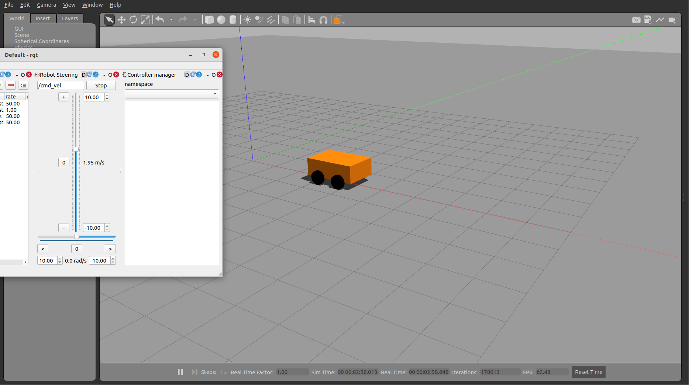

# 如何编写URDF

## 结果



## 标签

使用各种标签来规定机器人的形状，关节和物理属性

- [link](http://www.autolabor.com.cn/book/ROSTutorials/di-6-zhang-ji-qi-ren-xi-tong-fang-zhen/62-fang-zhen-urdf-ji-cheng-rviz/624-urdfyu-fa-xiang-jie-02-link.html)
- [joint](http://www.autolabor.com.cn/book/ROSTutorials/di-6-zhang-ji-qi-ren-xi-tong-fang-zhen/62-fang-zhen-urdf-ji-cheng-rviz/625-urdfyu-fa-xiang-jie-03-joint.html)

| **关节类型** | **自由度** |
| ------------ | ---------- |
| `revolute`   | 1          |
| `continuous` | 1          |
| `prismatic`  | 1          |
| `fixed`      | 0          |
| `floating`   | 6          |
| `planar`     | 3          |

这样可将机器人在rviz可视化

## 载入gazebo中

载入gazebo中，需要给link添加额外的标签

- 必须使用 collision 标签，因为既然是仿真环境，那么必然涉及到碰撞检测，collision 提供碰撞检测的依据。、
- 必须使用 inertial 标签，此标签标注了当前机器人某个刚体部分的惯性矩阵，用于一些力学相关的仿真计算。
- [可选]颜色设置，也需要重新使用 gazebo 标签标注，因为之前的颜色设置为了方便调试包含透明度，仿真环境下没有此选项。

```xml
<gazebo>
    <plugin name="ros_control" filename="libgazebo_ros_control.so">
        <robotNamespace>/</robotNamespace>
    </plugin>
</gazebo>
```

```xml
<!--.launch-->
<include file="$(find gazebo_ros)/launch/empty_world.launch">
    <arg name="paused" value="false"/>
    <arg name="world_name" value="$(find rm_gazebo)/worlds/empty.world"/>
</include>
<!--robot_state_publisher 将 URDF 中的关节信息发布到 ROS 的 TF 框架-->
<node pkg="joint_state_publisher" type="joint_state_publisher" name="joint_state_publisher" output="screen"/>
<node pkg="robot_state_publisher" type="robot_state_publisher" name="robot_state_publisher" output="screen"/>

<node name="spawn_urdf" pkg="gazebo_ros" type="spawn_model" args="-param robot_description -urdf -model car"
      output="screen"/>
```


## 载入控制器

需加载传动元件。传动元件的作用是将这些高层控制指令与底层硬件接口（如电机）绑定起来。

#### 无传动元件的问题

- 控制器无法知道应该如何操作具体的关节。
- 硬件接口无法接收来自控制器的命令。

#### 加入传动元件的好处

- 传动元件明确了**关节与物理电机（actuator）的关系**，包括控制模式（速度、位置或力）。
- 传动元件通过 `hardware_interface` 将控制器的命令转化为机器人实际关节的运动。

ROS 的 `ros_control` 框架需要一个完整的机器人模型，描述关节的运动特性。

#### 描述机器人硬件结构

- **关节的控制接口**：如 `PositionJointInterface`、`VelocityJointInterface` 或 `EffortJointInterface`。
- **机械传动关系**：如齿轮比或其他传动参数。

#### 参考链接

- [URDF Transmissions](https://wiki.ros.org/urdf/XML/Transmission)

```xml
<xacro:macro name="transmission_interface" params="name joint_type">
    <transmission name="${name}_transmission">
        <type>transmission_interface/SimpleTransmission</type>
        <joint name="${name}">
          <hardwareInterface>hardware_interface/VelocityJointInterface</hardwareInterface>
        </joint>
        <actuator name="${name}_motor">
          <hardwareInterface>hardware_interface/PositionJointInterface</hardwareInterface>
            <mechanicalReduction>1</mechanicalReduction>
        </actuator>
    </transmission>
</xacro:macro>
```

#### 获取urdf信息

```c++
URDFPhysicsReader(const std::string& urdf_str) {
    model_ = urdf::parseURDF(urdf_str);
    if (!model_) {
        throw std::runtime_error("Failed to parse URDF");
    }
}

// 获取关节参数
void getJointParams(const std::string& joint_name) {
    auto joint = model_->getJoint(joint_name);
    if (!joint) return;

    std::cout << "\nJoint: " << joint_name << std::endl;

    // 关节轴向
    if (joint->type != urdf::Joint::FIXED) {
        std::cout << "Axis: ["
            << joint->axis.x << ", "
            << joint->axis.y << ", "
            << joint->axis.z << "]" << std::endl;
    }

    // 关节限位
    if (joint->limits) {
        std::cout << "Limits - "
            << "Upper: " << joint->limits->upper
            << ", Lower: " << joint->limits->lower
            << ", Effort: " << joint->limits->effort
            << ", Velocity: " << joint->limits->velocity << std::endl;
    }
}

// 获取链接参数
void getLinkParams(const std::string& link_name) {
    auto link = model_->getLink(link_name);
    if (!link || !link->inertial) return;

    std::cout << "\nLink: " << link_name << std::endl;
    std::cout << "Mass: " << link->inertial->mass << " kg" << std::endl;

    // 惯性矩阵
    std::cout << "Inertia - "
        << "Ixx: " << link->inertial->ixx
        << ", Iyy: " << link->inertial->iyy
        << ", Izz: " << link->inertial->izz << std::endl;
}
```
