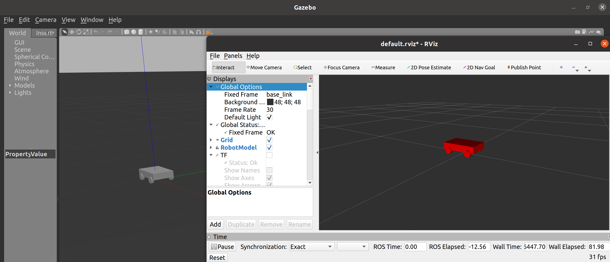

# URDF

URDF:统一机器人描述格式，是一个XML语法框架下用来描述机器人的语言格式。

将 URDF 文件引入 Gazebo 中，Gazebo 根据文件内容解析出机器人各个部分的信息，并在虚拟环境中创建出相应的三维模型。这个过程包括了**物理属性的设定**以及**动力学特性**。此外，URDF 还支持通过插件机制加载外部资源，比如视觉模型、传感器数据流等，使得机器人在模拟中更加真实和动态。

当 Gazebo加载 URDF 文件时，URDF 内容首先会转换为 SDFormat，然后再由Gazebo 处理。URDF 到 SDFormat 的转换通常会自动发生，也就是我们无需观察生成的 SDFormat 文件。为了诊断转换过程中可能出现的任何问题，这条命令可以把 URDF 文件转换为用户可以检查的 SDFormat：

```
gz sdf -p <path to urdf file>
```

## 总体参考

```xml
<robot name="">
	<link>
		<visual>
			<origin xyz="" rpy=""/>
			<geometry>
				<box size=""/>
			</geometry>
		</visual>
		<collision>
			<origin xyz="" rpy=""/>
			<geometry>
				<box size=""/>
			</geometry>
		</collision>
		<inertial>
			<origin xyz="" rpy=""/>
			<mass value=""/>
			<inertia ixx="" ixy="" ixz="" iyy="" iyz="" izz=""/>
		</inertial>
	</link>

	<joint name="" type="">
		<origin xyz="" rpy=""/>
		<parent link=""/>
		<child link=""/>
		<axis xyz=""/>
	</joint>

	<transmission name="">
		<type>transmission_inteerface/SimpleTransmission</type>
		<joint name="">
			<hardwareInterface>hardware_interface/EffortJointInterface</hardwareInterface>
		</joint>
		<actuator>
			<hardwareInterface>hardware_interface/EfforJointInterface</hardwareInterface>
			<mechanicalReduction>1</mechanicalReduction>
		</actuator>
	</transmission>

	    <gazebo>
        <plugin name="ros_control" filename="libgazebo_ros_control.so">
        </plugin>
    </gazebo>

</robot>
```

## 详解

### robot

机器人描述文件中的根元素必须是**robot** ，所有其他元素必须封装在其中。

元素：<link>  <joint>   <transmission>  <gazebo>

example:

```xml
<robot name="pr2">
  <!-- pr2 robot links and joints and more -->
</robot>
```

### link

link 元素描述了具有惯性、视觉特征和碰撞属性的刚体，队里要求每一个link需要包含inertial、visual、collision三个标签

##### **1.<inertial>  **

##### **它描述连杆的惯性特性**

**<origin>** (可选，defaults to identity if not specified)

它定义相对于连杆坐标系的惯性参考系的参考坐标，该坐标必需定义在连杆重心处，其坐标轴可与惯性主轴不平行

- xyz (可选，默认为零向量)

  表示 x,y,*z* 方向的偏置，单位为米

- rpy(可选，defaults to identity if not specified)

  表示坐标轴在RPY上的旋转，单位为弧度

**<mass>**

连杆的质量属性

**<inertia>**

3×3旋转惯性矩阵，由六个独立的量组成：ixx, ixy, ixz, iyy, iyz, izz

#### **2.<visual> **

##### 连杆的可视化属性。用于指定连杆显示的形状（矩形、圆柱体等），同一连杆可以存在多个visual元素，连杆的形状为多个元素两个形成

**<namel>** (可选)

它是连杆几何形状的名字。

**<origin>** (可选，defaults to identity if not specified)

它定义了相对于连杆的坐标系的几何形状坐标系

- xyz (optional: defaults to zero vector)

  表示x,y,*z* 方向的偏置，单位为米

  rpy (optional: defaults to identity if not specified)

​        表示坐标轴在RPY方向上的旋转，单位为弧度

**<geometry>** （必需）

可视化对象的形状，可以是下面的其中一种：

- **<box>**

  矩形，元素包含长、宽、高。原点在中心

- **<cylinder>**

  圆柱体，元素包含半径、长度。原点中心

- **<sphere>**

  球体，元素包含半径。原点在中心

- **<mesh>**

  网格，由文件决定，同时提供 scale ，用于界定其边界。支持.stl文件，必须是本地文件

**<material>** (可选)

可视化组件的材料。可以在link标签外定义，但必需在robot标签内，在link标签外定义时，需引用link的名字

- **<color>**(可选)
  - 颜色，由 red/green/blue/alpha 组成，大小范围在 [0,1] 内

- **<texture>**(可选)
  - 材料属性，由文件定义

**3.<collision>**

**连杆的碰撞属性。碰撞属性和连杆的可视化属性不同，简单的碰撞模型经常用来简化计算。同一个连杆可以有多个碰撞属性标签，连杆的碰撞属性表示由其定义的几何图形集构成。**

**<origin>** (可选，defaults to identity if not specified)

碰撞组件的参考坐标系相对于连杆坐标系的参考坐标系

- xyz (可选， 默认零向量)

  表示x,y,*z* 方向的偏置，单位为米

- rpy (可选， defaults to identity if not specified)
  - 表示坐标轴在RPY方向上的旋转，单位为弧度

**<geometry>**

与上述geometry元素描述相同


### joint

关节元素描述了关节的运动学和动力学，并指定了关节的安全极限

##### tips:

两个必要元素name和type。其中type要正确选择：**转动关节**: continous 是没有限位的转动关节，可以绕单轴无限旋转 revolute是有限位的转动关节，有一定的旋转角度限制；**平动关节**: prismatic 是沿某一轴滑动的关节；**固定关节**: fixed 是不允许运动的关节


**<origin>** (可选，defaults to identity if not specified)
从parent link到child link的变换，joint位于child link的原点，修改该参数可以调整连杆的位置

- xyz (可选: 默认为零向量)
  代表x,*y*,*z*轴方向上的偏移，单位米
- rpy (可选: 默认为零向量)
  代表绕着固定轴旋转的角度：roll绕着x轴,pitch绕着y轴，yaw绕着z轴，用弧度表示

**<parent>** (必需)

parent link的名字是一个强制的属性

- link

  parent link的名字，是这个link在机器人结构树中的名字

**<child>** (必需)

child link的名字是一个强制的属性

- link

  child link的名字，是这个link在机器人结构树中的名字

**<axis>**(可选: 默认为(1,0,0))

joint的axis轴在joint的坐标系中。这是旋转轴(revolute joint)，prismatic joint移动的轴，是planar  joint的标准平面。这个轴在joint坐标系中被指定。修改该参数可以调整关节的旋转所绕着的轴，常用于调整旋转方向，若模型旋向与实际相反，只需乘-1即可。固定(fixed)和浮动(floating)类型的joint不需要用到这个元素

- xyz(必需)

  代表轴向量的x,y,*z*分量，为标准化的向量

**<calibration>** (可选)

joint的参考点，用来矫正joint的绝对位置

- rising (可选)

  当joint正向运动时，参考点会触发一个上升沿

- falling (可选)

  当joint正向运动时，参考点会触发一个下降沿

**<dynamics>**(可选)

该元素用来指定joint的物理性能。它的值被用来描述joint的建模性能，尤其是在仿真的时候

- damping(可选，默认为0)

  joint的阻尼值

- friction(可选，默认为0)

  joint的摩擦力值

**<limit>** (当关节为旋转或移动关节时为必需)

该元素为关节运动学约束

- lower (可选, 默认为0)

  指定joint运动范围下界的属性(revolute joint的单位为弧度，prismatic joint的单位为米)，连续型的joint忽略该属性

- upper (可选, 默认为0)

  指定joint运动范围上界的属性(revolute joint的单位为弧度，prismatic joint的单位为米)，连续型的joint忽略该属性

- effort (必需)

  该属性指定了joint运行时的最大的力

- velocity (必须)

  该属性指定了joint运行时的最大的速度


### transmission

在这里可以描述执行器与关节之间的关系

### Gazebo

导入必须要有相应的plugin



