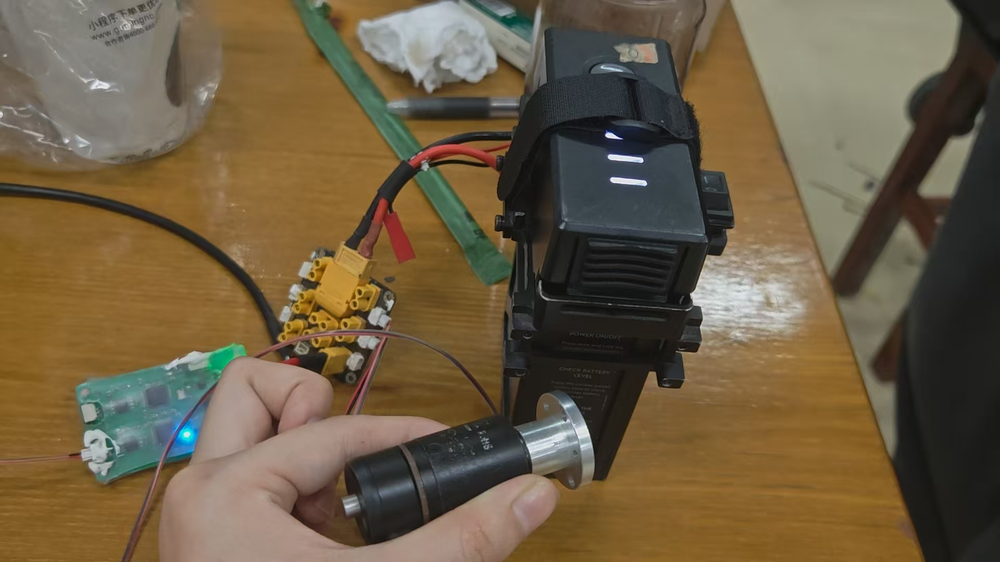
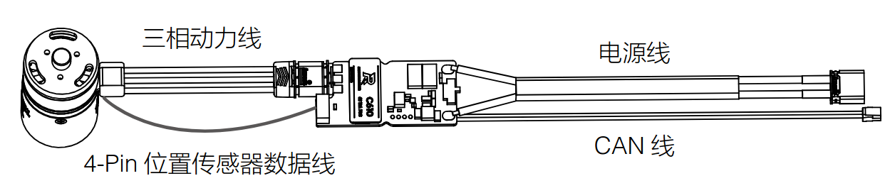

# 电机驱动

### 总体逻辑：

**目标力矩>>电流指令>>电机响应>>关节力矩反馈**

控制器可根据运动规划生成目标关节力矩，通过effort_interface传递到驱动层，驱动层利用URDF中定义的减速比将目标关节力矩转换为电机轴需求扭矩，再换算为电流指令并映射成CAN控制量，进而驱动电机转动。电机执行后通过编码器反馈计算实际输出关节力矩，并通过joint_state回传控制器，控制器对比误差进行调整。

### 步骤：

**step 1 : 电机连接与SocketCAN配置：**

连接各种线，上电,以M2006为例：





每次使用要重新配置SocketCAN才能使用：

```shell
sudo ip link set can0 up type can bitrate 1000000
```

监听用这个命令：

```shell
candump can0
```

**step 2 : 在硬件参数文件进行配置**

以windmill_hw.yaml为例：

```yaml
rm_hw:
  bus:                                    # 填多少个取决于有多少个can接口
    - can0
    - can1
  loop_frequency: 1000
  cycle_time_error_threshold: 0.001
  thread_priority: 95
  # Configurations of the actuators
  actuators:
    rotation_joint_motor:                 #actuators的名字要跟URDF里的一致
      bus: can0                           
      id: 0x201                           #同一can线上id不能重
      type: rm_2006                       #type一定要填对，不然有概率疯掉
      lp_cutoff_frequency: 30
```

此外需要用到队里的actuator_coefficient.yaml文件，它标定了电机系数，用于硬件差异对齐、双向换算:

```yaml
actuator_coefficient:
  rm_3508: # RoboMaster 3508 without reducer
    act2pos: 0.0007669903  # 2PI/8192
    act2vel: 0.1047197551   # 2PI/60
    act2effort: 1.90702994e-5  # 20/16384*0.0156223893
    effort2act: 52437.561519   # 1/act2effort
    max_out: 16384
  rm_6020: # RoboMaster 3508 motor
    act2pos: 0.0007670840  # 2PI/8192
    act2vel: 0.1047197551   # 2PI/60
    act2effort: 5.880969e-5  # special coefficient identify by hands...
    effort2act: 25000   #
    max_out: 30000
  rm_2006: # RoboMaster 2006 motor
    act2pos: 2.13078897e-5  # 2PI/8192*(1/36)
    act2vel: 0.0029088820   # 2PI/60*(1/36)
    act2effort: 0.00018  #10/10000*0.18
    effort2act: 5555.5555555   # 1/act2effort
    max_out: 10000
  cheetah: # MIT cheetah motor
    act2pos: 0.00291447 # 191/65535
    act2vel: 0.0219780219    # 90/4095
    act2effort: 0.008791208  # 36/4095
    pos2act: 343.115183         # 65535/191
    vel2act: 45.5           # 4095/90
    effort2act: 113.75      # 4095/36
    max_out: 0
    act2pos_offset: -95.5
    act2vel_offset: -45.0
    act2effort_offset: -18.0
    kp2act: 8.19            # 4095/500
    kd2act: 819             # 4095/5
```

**step 3 : 加控制器及其相关参数文件**

写好launch文件，launch即可

<u>USB2CAN模块上两边分别有两个灯，外面闪代表有接收，里面闪代表有发送，若没有是常亮的</u>

由此可实现控制闭环，电机转动
